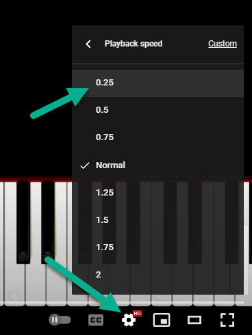

# video-to-midi

Detect virtual piano keys in a video and convert the changes to a midi file

piano video screenshot with detection points in purple

## How to make a capture

* Clone the repo or download the zip
* Make sure you have [NodeJS 16+](https://nodejs.org) installed
* Install the dependencies by running the command in the root of the folder in your terminal: `npm install`
* Open the index.ts file and set the song duration (should be more than the song length. eg: 4.5 minutes => 5)
  
* Set the video playback speed to 0.25
  
* Start the program: `npm start`
* Calibrate the piano keyboard:
  
    1. While keeping the terminal focused
    2. Hover over the top of left most key on the keyboard and press enter
    3. Hover over the top of the right most key on the keyboard and press enter
    4. Hover over the top of the C4 (do) key and press enter
* Enter how many keys are on the keyboard. Usually somewhere around or less than 72
* The capture has started, start the video
* Do not use the computer until the video has done capturing and the console shows: `File song.mid written to disk`
* It uses the screen colors to detect the pressed keys
